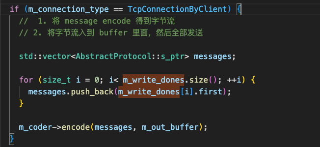
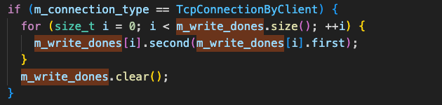
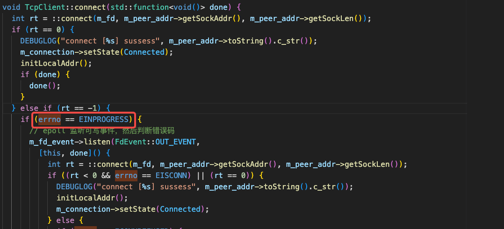

#### 简介 

这个用于梳理rocket中tinyrpc不会的项目，用于记录

> 需要完成的功能
- 每一个类的具体含义 ——> 延伸出整个网络架构是怎么样的
- 运行调通过
- 如何运用日志内容，这里应该是tinyxml的使用，可以一通百通运用到其他项目中去
- 给其他人讲解这个项目的来源
- 结合之前视频上不清晰的


####TCP文件大类

##### net_addr 类


这里的类封装  IP + PORT 变成 sockaddr_in ：
    里面会指明 FAMILLY + IP + PORT，这里toString返回字符串（IP + PORT）


##### tcp_acceptor类

这里的类用于 server端用于创建监听套接字
- setsockopt 用于 创建套接字
- bind 套接字  
- listen 监听


accept 用于server 和 客户端的连接，这里是在三次握手之后


##### tcp_buffer类
这个是


##### tcp_connection
记录每一次tcp连接需要进行的操作
输入缓冲区——输出缓冲区（用来更好存储数据）
m_fd_event 这里得到tcp连接对应的fd，用于读写操作 (这里通过fcntl设置NonBlock)

如果在tcpserver上，需要使用epoll监听可读事件，加入EpollEvent

- listenRead()用于监听可读事件，绑定onRead()事件

- listenWrite()用于监控可写事件，绑定onWrite()事件

- execute 执行逻辑处理
  - 在服务器端首先按照tinyPB格式解码，得到解码组vector<AbstractProtocol::s_ptr> message
    - 调用RpcDispatcher的dispatch方法：将解码的信息，将request->response，将调用的方法解析，然后填入到tcp的connection中，service->CallMethod(method, rpc_controller, req_msg, rsp_msg, closure);
      - 处理完毕之后，会调用 ‘reply’ 函数发送给，对处理之后的数据信息进行编码，然后注册listenWrite()函数 （这里问题来了，这个时候数据应该还没有发送到缓冲区，由此还没有被监听吧。如果触动的话，会调用onWrite函数）

- onWrite 函数
  - 如果写入buffer的话，那readIndex 和 WriteIndex应该要随时变化吧，这个变化体现在哪里？
  - 如果全部写入的话，就取消可写事件（这样防止epoll一直出发可写事件，但是实际上不用触发）
  - 这里write关于缓冲区的情况需要仔细考虑，最好输出一片文档





##### tcp_client类

Client类
    创建客户端套接字，之后和TcpConnection关联
    errno这里应该是固定的，不需要定义
    如果处于EINPROGRESS的时候，为什么需要监听写套接字，难道这里是wakeup用法


    调用addTimerEvent 用于保存远程连接作用？？？
    writeMessage readMessage 用来发送message，之后调用done

##### tcp_server类

使用tcp_acceptor建立连接；IOThreadGroup建立IO线程组（给套接字使用）;创建可读事件，并且加入监听
创建监听事件


#### coder

##### tinypb_protocol类

定义该类的字段：
  方法名 + 错误代码 + 错误信息 + 数据值


##### tinypb_coder类

encoder(messages, out_buffer) 使用messages转化out_buffer

decoder(out_messages, buffer) 将buffer 里面的字节流转化为messages对象

message 构成：
  m_pk_len + m_msg_id_len + m_msg_id + m_method_name_len + m_err_code  + m_err_info_len + m_err_info + m_pb_data + parse_success


#### rpc 

##### rpc_controler 类
这里主要是设定类：
  m_error_code
  m_error_info
  m_msg_id
  m_is_failed
  m_is_cancled 这个作用是什么
  m_is_finished
  m_local_addr
  m_peer_addr
  m_timeout

##### rpc_interface
接口类，有待拓展

##### rpc_channel 类
这里没有看懂，后面debug一下


##### rpc_dispatcher 类
将request 和 response 关联起来，
  将 req_protocol->m_pb_data 转化为 req_msg (service->GetRequestPrototype(method).New())通过来构建, rsp_msg 通过 service->GetResponsePrototype(method).New();
调用closure，将rspprotocol放到replay_messages中，调用连接的reply方法（将replay_messages写入out_buffer中，然后注册写入监听事件）


#### fd_event 类
对epoll_event事件进行封装，用于控制套接字是否阻塞；监听事件类型及其回调函数；

#### fd_event_group 类
设置 fd_event_group 的大小，std::vector<FdEvent>设定的大小

#### IO_THREAD 类
创建线程，pthread_create(&m_thread, NULL, &IOThread::Main, this)
  这个时候线程已经开始运行了，但我们可以通过信号量
  sem_wait 用于信号量的wait， sem_post 用于信号量的post（解放信号量）


#### IOThreadGroup 类
这个线程池可以换种方式（这里可以使用sx的线程池设计，需要学习一下）

下面这个代码如果不按照线程顺序析构的话，会出现什么情况，好像这样的代码就不合适了
```c++
IOThread* IOThreadGroup::getIOThread() {
  if (m_index == (int)m_io_thread_groups.size() || m_index == -1)  {
    m_index = 0;
  }
  return m_io_thread_groups[m_index++];
}
```

#### timer 类

这里使用 timerfd_create 创建套接字，并且将可读事件

使用multimap 来存储定时事件，如果在现在到期的事件结束，如果定时事件中设置了重复的定时事件，需要重新加入
    重新设置时间，现在定时器的触发时间。如果后面发生的时间，直接设置与当前时间节点为的距离；否则设置为100

###### addTimerEvent
    这里为什么需要调用resetArriveTime()，因为如果重复事件触发之后，可能在定时器事件之前，这个时候需要调整重复事件在前面

###### deleteTimerEvent
这个为什么要使用upper_bound 和 lower_bound

##### wakup_fd 事件
这里如果是wakeup事件，向缓冲区写入一个字节，用于触发事件


#### eventloop
eventloop 主要分为 主线程（监听连接，分配线程给子线程）；
                  分线程(监听读写事件)
                  wakeup事件(用于主线程给分线程唤醒时起作用，如果没有wakeup的情况是怎么样的)

如果不同同一个线程的话，把任务交给m_pending_tasks。
先执行m_pending_tasks
这些事件很奇怪，使用addTask加入到m_pending_tasks

####    


question：
1. IO线程的分配体现在哪里，在server代码体现吗，8-15要验证一下
这里在server体现过了，把任务放入到线程池中，让他去取


2. 异步日志也有注册日志信息，这个代码还没有梳理
3. 还没有debug（这个要克服畏难心理） 8-15完成

